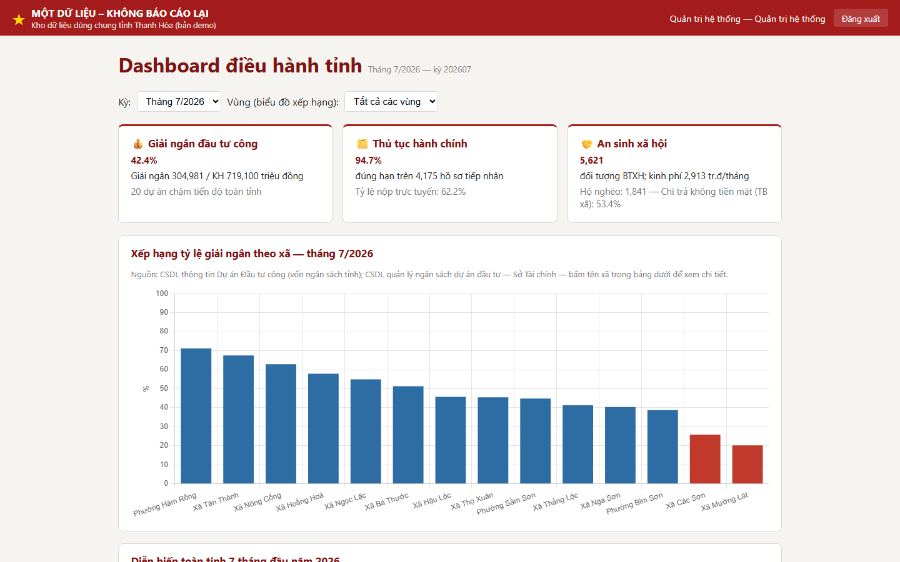
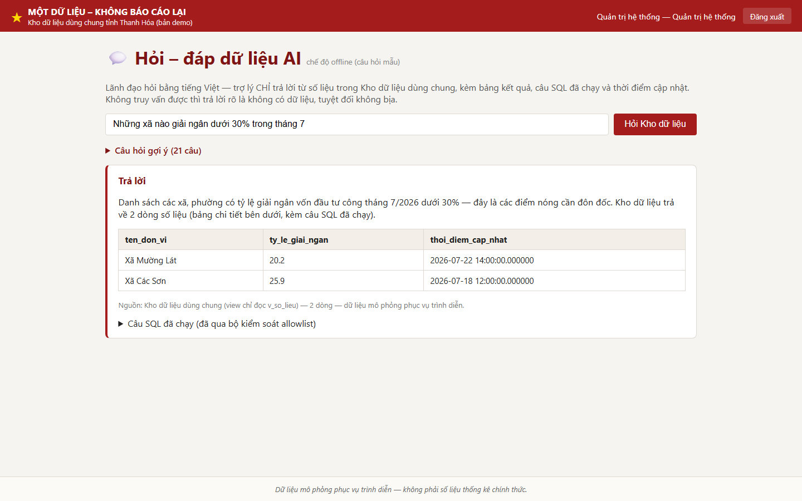
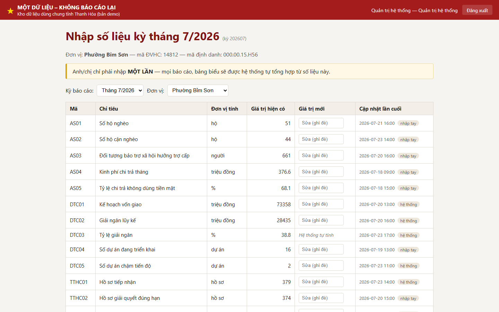
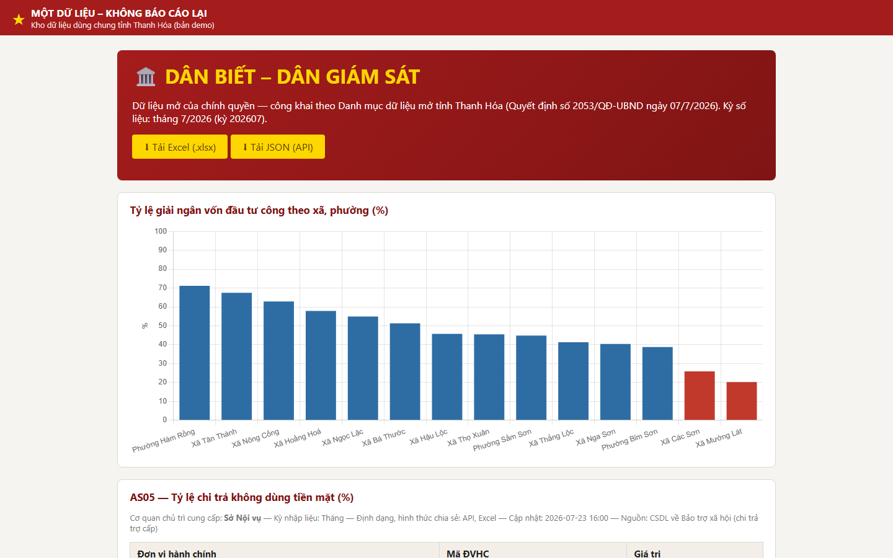
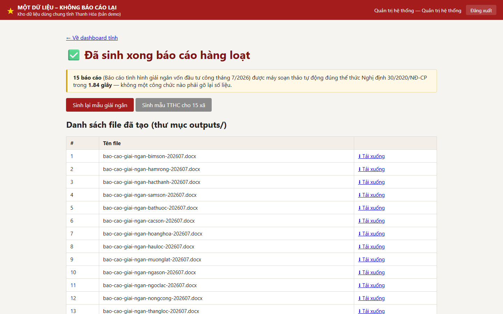
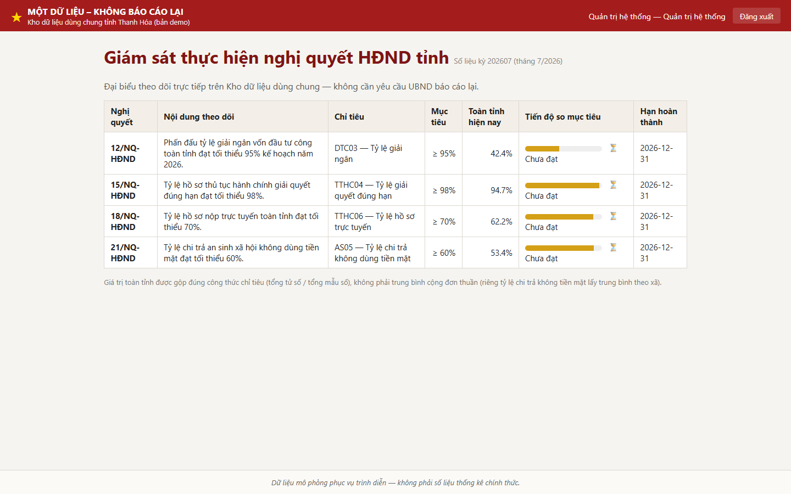
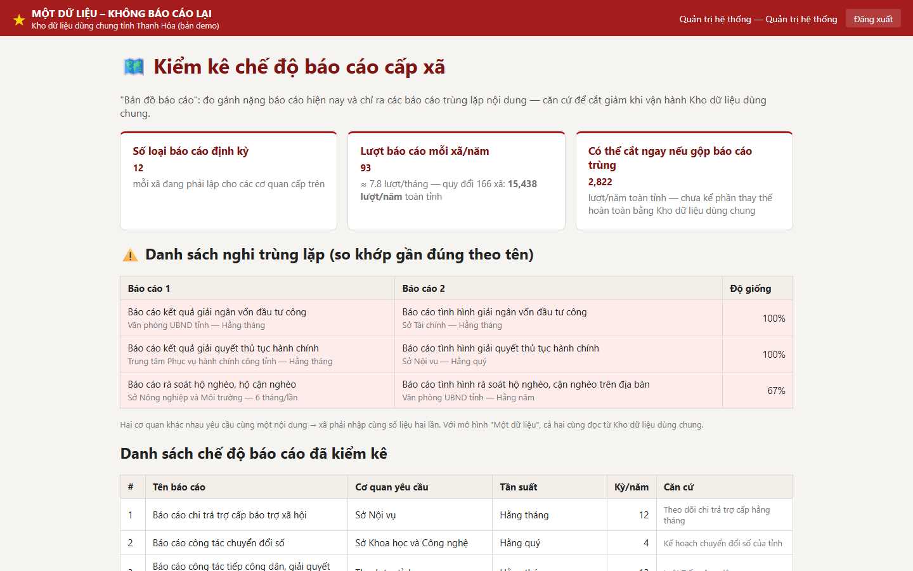

# Một dữ liệu – Không báo cáo lại

> Bản demo dự thi Cuộc thi "Tìm kiếm ý tưởng, giải pháp cải cách hành chính
> tỉnh Thanh Hóa năm 2026".

**Mô hình**: mỗi số liệu chỉ nhập **một lần** tại nguồn (cấp xã); Kho dữ liệu
dùng chung tự tổng hợp; **báo cáo do máy soạn** đúng thể thức Nghị định
30/2020/NĐ-CP; lãnh đạo **hỏi – đáp trực tiếp trên dữ liệu** thay vì yêu cầu
cấp dưới báo cáo; người dân giám sát qua **trang công khai dữ liệu mở**.
Căn cứ trực tiếp: Quyết định số 2053/QĐ-UBND ngày 07/7/2026 (Danh mục dữ liệu
chủ, dùng chung, mở) và Quyết định số 2176/QĐ-UBND ngày 20/7/2026 (Bộ trường
thông tin dữ liệu) của Chủ tịch UBND tỉnh Thanh Hóa — trong đó quy định phân
quyền cho UBND cấp xã cập nhật dữ liệu, **"không yêu cầu báo cáo thủ công"**.

> ⚠️ **Toàn bộ số liệu trong demo là DỮ LIỆU MÔ PHỎNG phục vụ trình diễn —
> không phải số liệu thống kê chính thức.**

**Xem nhanh không cần cài đặt:**

- 🌐 Trang giới thiệu (GitHub Pages): <https://sonthkh-alt.github.io/onedata-thanhhoa/>
- 🚀 Bản chạy thử online (Render, gói miễn phí — lần mở đầu chậm ~30–60 giây
  do dịch vụ "ngủ"): <https://onedata-thanhhoa.onrender.com>

Cách deploy bản online: đăng nhập [render.com](https://render.com) bằng tài
khoản GitHub → **New + → Blueprint** → chọn repo này → **Apply** (cấu hình đã
có sẵn trong [render.yaml](render.yaml); CSDL mô phỏng tự seed mỗi lần khởi
động).

## Ảnh chụp màn hình

| Dashboard điều hành | Hỏi – đáp dữ liệu AI |
|---|---|
|  |  |

| Nhập liệu tại nguồn | Trang công khai |
|---|---|
|  |  |

| Sinh 15 báo cáo NĐ30 | Giám sát HĐND | Kiểm kê báo cáo |
|---|---|---|
|  |  |  |

## Tính năng chính (8 phân hệ)

| # | Phân hệ | Đường dẫn |
|---|---------|-----------|
| 1 | Đăng nhập, phân quyền 4 vai trò, nhật ký đầy đủ | `/dang-nhap` |
| 2 | Nhập liệu tại nguồn — "nhập MỘT LẦN", chỉ tiêu dẫn xuất tự tính | `/nhap-lieu` |
| 3 | Dashboard điều hành: 3 lĩnh vực, xếp hạng, diễn biến 7 tháng | `/dashboard` |
| 4 | Máy soạn báo cáo .docx thể thức NĐ 30/2020/NĐ-CP — 15 báo cáo trong vài giây | `/bao-cao/tao-tat-ca` |
| 5 | Hỏi – đáp dữ liệu AI (offline/online, SQL có kiểm soát, không bịa số liệu) | `/hoi-dap` |
| 6 | Cảnh báo sớm theo ngưỡng — bảng "điểm nóng" | trong `/dashboard` |
| 7 | Trang công khai dữ liệu mở + giám sát nghị quyết HĐND | `/cong-khai`, `/giam-sat` |
| 8 | Kiểm kê báo cáo — gánh nặng báo cáo, phát hiện trùng lặp | `/kiem-ke` |

Ba lĩnh vực dữ liệu demo: **giải ngân đầu tư công**, **thủ tục hành chính**,
**an sinh xã hội** — 15 xã/phường, kỳ tháng 01–07/2026.

## Cài đặt và chạy (≈ 5 phút, không cần Internet sau khi cài)

Yêu cầu: Python ≥ 3.11.

```bash
git clone https://github.com/sonthkh-alt/onedata-thanhhoa.git
cd onedata-thanhhoa

python -m venv .venv
# Windows:
.venv\Scripts\activate
# Linux/macOS:
# source .venv/bin/activate

pip install -r requirements.txt

# Tạo CSDL + dữ liệu mô phỏng (15 xã × 16 chỉ tiêu × 7 tháng)
python scripts/seed.py

# (Tùy chọn) sinh sẵn vài báo cáo mẫu ra outputs/
python scripts/make_demo_reports.py

# Chạy ứng dụng
uvicorn app.main:app --reload
```

Mở trình duyệt: <http://127.0.0.1:8000> — ứng dụng chạy **hoàn toàn offline**
(font, CSS, Chart.js đều được đóng gói sẵn, không dùng CDN).

## Tài khoản demo

| Tài khoản | Mật khẩu | Vai trò |
|-----------|----------|---------|
| `lanhdao` | `Demo@2026` | Lãnh đạo tỉnh — dashboard, hỏi đáp AI, sinh báo cáo |
| `xa.hacthanh` | `Demo@2026` | Chuyên viên phường Hạc Thành — nhập liệu tại nguồn |
| `daibieu` | `Demo@2026` | Đại biểu HĐND — giám sát nghị quyết (chỉ đọc) |
| `admin` | `Demo@2026` | Quản trị hệ thống — toàn quyền |

## Kịch bản demo 5 phút

1. Đăng nhập `xa.hacthanh` → **Nhập số liệu** tháng 7 (2 ô còn trống: giải
   ngân lũy kế, kinh phí chi trả) → nhấn mạnh *"chỉ nhập một lần"*, hệ thống
   tự tính tỷ lệ giải ngân.
2. Đăng nhập `lanhdao` → **Dashboard** thấy ngay số vừa nhập; bảng **điểm
   nóng** nêu 2 xã giải ngân dưới 30%.
3. **Hỏi AI**: "Những xã nào giải ngân dưới 30% trong tháng 7?" → trả lời +
   bảng số liệu + câu SQL + nguồn.
4. Bấm **"Tạo báo cáo tháng 7 cho tất cả 15 xã"** → mở 1 file .docx cho khán
   giả xem thể thức chuẩn NĐ30 → nêu con số *"15 báo cáo trong X giây"*.
5. Đăng nhập `daibieu` → trang **giám sát nghị quyết**; mở trang **công khai**
   không cần đăng nhập → chốt thông điệp *"dân biết – dân giám sát"*.

## Chế độ AI online (tùy chọn, cần Internet)

Mặc định demo chạy **offline** với ~20 câu hỏi mẫu. Muốn dùng Claude API:

```bash
cp .env.example .env
# Sửa .env: OFFLINE=0 và điền ANTHROPIC_API_KEY
```

Mọi SQL do AI sinh đều qua bộ kiểm soát (sqlglot): chỉ SELECT, chỉ trên 3 view
chỉ đọc, tự thêm LIMIT — AI **không được bịa số liệu**, không truy vấn được
thì trả lời rõ "Không có dữ liệu phù hợp trong Kho".

## Kiểm thử và chất lượng mã

```bash
pytest            # 69 test: seed, phân quyền, UNIQUE, validator SQL, docx NĐ30
ruff check .
black --check .
```

## Chuẩn tuân thủ

- Thể thức văn bản: **Nghị định 30/2020/NĐ-CP**.
- Danh mục dữ liệu, cơ quan chủ quản, dữ liệu mở: **QĐ 2053/QĐ-UBND
  07/7/2026**.
- Bộ trường thông tin (mã định danh QCVN 102:2016/BTTTT, mã ĐVHC, kỳ YYYYMM,
  ngày ISO, công thức/ràng buộc chỉ tiêu): **QĐ 2176/QĐ-UBND 20/7/2026**.
- Nguyên tắc chất lượng dữ liệu: *"Đúng - Đủ - Sạch - Sống - Liên thông -
  Thống nhất - Dùng chung"*.

## Tuyên bố dữ liệu

Đây là sản phẩm demo. **15 xã/phường demo là đơn vị thật** (tên và mã ĐVHC
5 chữ số lấy từ danh mục 166 xã, phường theo Nghị quyết 1686/NQ-UBTVQH15 —
file `data/seed/donvi_hanhchinh_thanhhoa_166.json`, seed tự đối chiếu khi
chạy). Tuy nhiên **toàn bộ SỐ LIỆU, mã định danh cơ quan, phân vùng
đô thị/đồng bằng/miền núi, phân loại I/II/III và họ tên người ký báo cáo đều
là mô phỏng/giả định** — không phải số liệu thống kê chính thức của bất kỳ
đơn vị nào.

## Giấy phép và liên hệ

- Giấy phép: [MIT](LICENSE) — © 2026 Hà Ngọc Sơn.
- Liên hệ: Hà Ngọc Sơn <!-- TODO: bổ sung email/SĐT liên hệ khi nộp bài -->.
