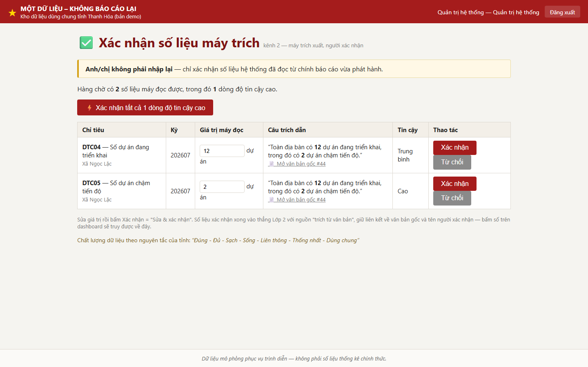
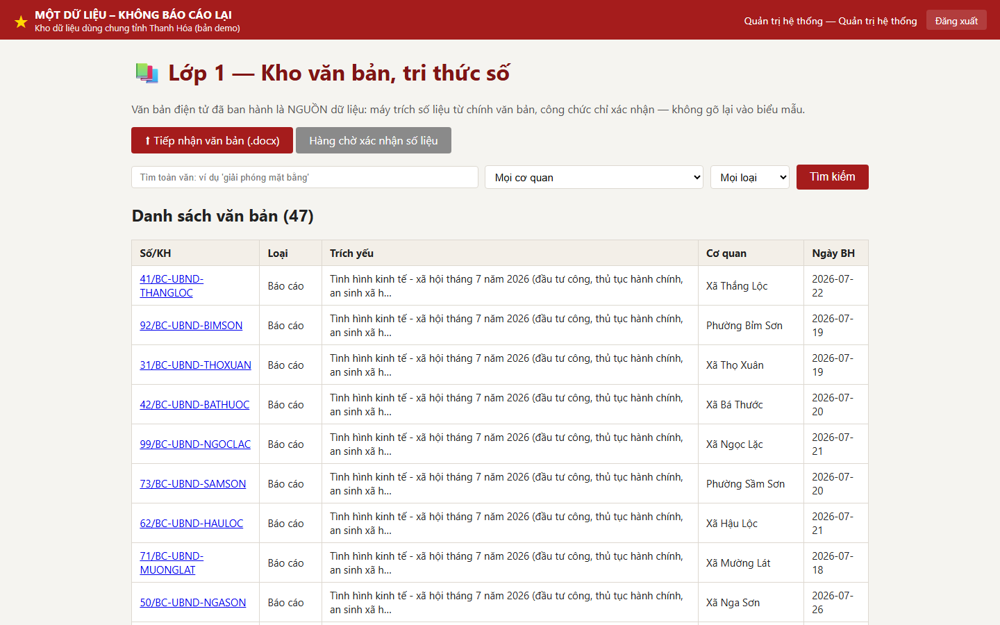
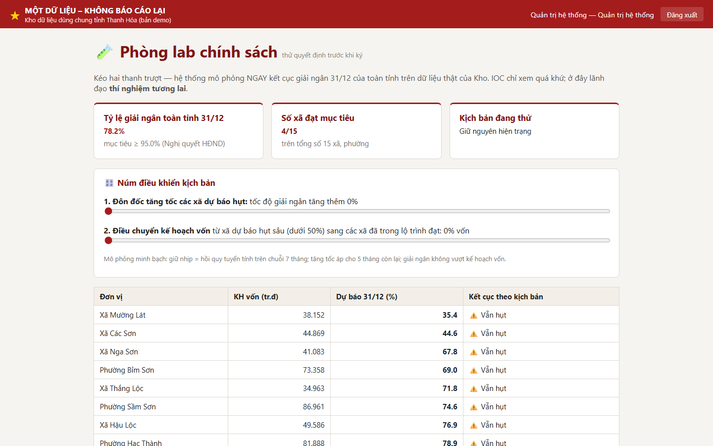
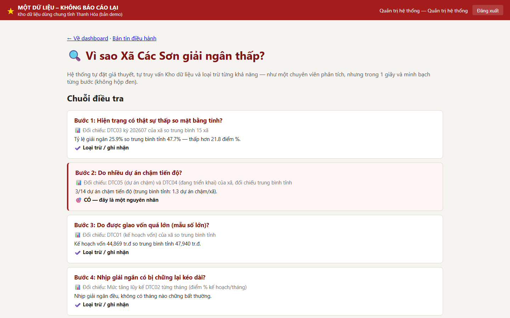
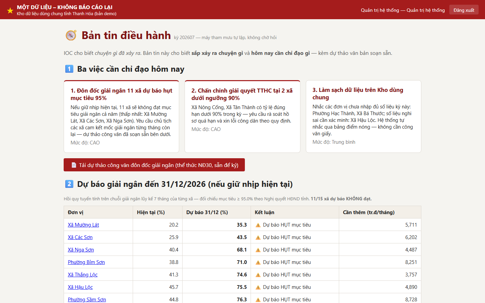
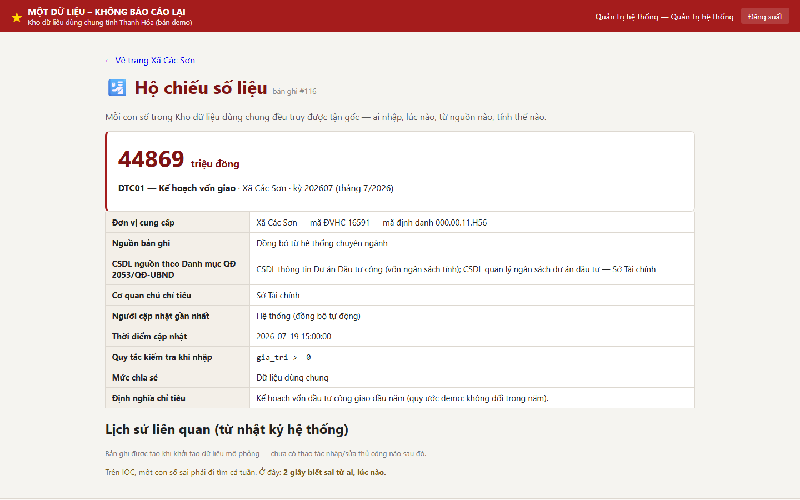
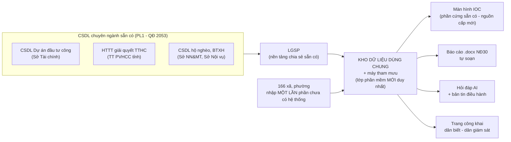

# Một dữ liệu – Không báo cáo lại

> Bản demo dự thi Cuộc thi "Tìm kiếm ý tưởng, giải pháp cải cách hành chính
> tỉnh Thanh Hóa năm 2026".

**Mô hình v0.2 — Kho dữ liệu HAI LỚP, BA KÊNH thu nhận**: Lớp 1 là kho
**văn bản – tri thức số** (toàn văn + tìm kiếm FTS5); Lớp 2 là **chỉ tiêu có
cấu trúc**. Số liệu vào Kho một lần từ đúng nguồn: kênh 1 — hệ thống nghiệp
vụ; **kênh 2 (điểm nhấn) — MÁY TRÍCH XUẤT đọc số liệu từ chính văn bản, báo
cáo điện tử vừa phát hành, công chức CHỈ XÁC NHẬN, không gõ lại**; kênh 3 —
nhập tại nguồn phần còn thiếu. Báo cáo do máy soạn đúng thể thức Nghị định
30/2020/NĐ-CP; lãnh đạo **hỏi – đáp AI xuyên hai lớp** (số liệu + văn bản,
bắt buộc dẫn nguồn); người dân giám sát qua **trang công khai dữ liệu mở**.
"Một lần" không có nghĩa là gõ tay một lần — mà là dữ liệu vào Kho một lần
từ đúng nguồn; số liệu đã có trong Kho thì **không cơ quan nào được yêu cầu
báo cáo lại**.
Căn cứ trực tiếp: Quyết định số 2053/QĐ-UBND ngày 07/7/2026 (Danh mục dữ liệu
chủ, dùng chung, mở) và Quyết định số 2176/QĐ-UBND ngày 20/7/2026 (Bộ trường
thông tin dữ liệu) của Chủ tịch UBND tỉnh Thanh Hóa — trong đó quy định phân
quyền cho UBND cấp xã cập nhật dữ liệu, **"không yêu cầu báo cáo thủ công"**.

> ⚠️ **Toàn bộ số liệu trong demo là DỮ LIỆU MÔ PHỎNG phục vụ trình diễn —
> không phải số liệu thống kê chính thức.**

**Xem nhanh không cần cài đặt:**

- 🌐 Trang giới thiệu (GitHub Pages): <https://sonthkh-alt.github.io/onedata-thanhhoa/>
- 🚀 Bản chạy thử online (Render, gói miễn phí — lần mở đầu chậm ~30–60 giây
  do dịch vụ "ngủ"): <https://onedata-thanhhoa.onrender.com>

Cách deploy bản online: đăng nhập [render.com](https://render.com) bằng tài
khoản GitHub → **New + → Blueprint** → chọn repo này → **Apply** (cấu hình đã
có sẵn trong [render.yaml](render.yaml); CSDL mô phỏng tự seed mỗi lần khởi
động).

## Ảnh chụp màn hình

| 🆕 Kênh 2: Xác nhận số liệu máy trích | 🆕 Lớp 1: Kho văn bản + tìm kiếm |
|---|---|
|  |  |

| 🆕 Phòng lab chính sách What-if | 🆕 AI điều tra nguyên nhân |
|---|---|
|  |  |

| 🆕 Bản tin điều hành (máy tham mưu) | 🆕 Hộ chiếu số liệu |
|---|---|
|  |  |

| Dashboard điều hành | Hỏi – đáp dữ liệu AI |
|---|---|
|  |  |

| Nhập liệu tại nguồn | Trang công khai |
|---|---|
|  |  |

| Sinh 15 báo cáo NĐ30 | Giám sát HĐND | Kiểm kê báo cáo |
|---|---|---|
|  |  |  |

## Tính năng chính (v0.2 — hai lớp, ba kênh)

| # | Phân hệ | Đường dẫn |
|---|---------|-----------|
| 1 | Đăng nhập, phân quyền 4 vai trò, nhật ký đầy đủ | `/dang-nhap` |
| 1b | **Lớp 1 — Kho văn bản, tri thức số**: tiếp nhận .docx, bóc siêu dữ liệu, toàn văn + tìm kiếm FTS5, chặn văn bản mật | `/van-ban` |
| 1c | **Kênh 2 — Máy trích xuất & màn hình xác nhận (ĐIỂM NHẤN)**: máy đọc số liệu từ văn bản ("45.000 triệu đồng", "27,0%"), người xác nhận/sửa/từ chối, nút "xác nhận tất cả tin cậy cao" | `/trich-xuat` |
| 2 | Kênh 3 — Nhập tại nguồn: CHỈ hiện chỉ tiêu chưa có từ kênh 1/2 | `/nhap-lieu` |
| 3 | Dashboard điều hành: 3 lĩnh vực, xếp hạng, diễn biến 7 tháng | `/dashboard` |
| 4 | Máy soạn báo cáo .docx thể thức NĐ 30/2020/NĐ-CP — 15 báo cáo trong vài giây | `/bao-cao/tao-tat-ca` |
| 5 | Hỏi – đáp dữ liệu AI (offline/online, SQL có kiểm soát, không bịa số liệu) | `/hoi-dap` |
| 6 | Cảnh báo sớm theo ngưỡng — bảng "điểm nóng" | trong `/dashboard` |
| 7 | Trang công khai dữ liệu mở + giám sát nghị quyết HĐND | `/cong-khai`, `/giam-sat` |
| 8 | Kiểm kê báo cáo — gánh nặng báo cáo, phát hiện trùng lặp | `/kiem-ke` |

**Máy tham mưu (tầng vượt IOC):**

| # | Tính năng | Đường dẫn |
|---|-----------|-----------|
| 9 | **Bản tin điều hành chủ động** — dự báo giải ngân 31/12 (hồi quy trên chuỗi 7 tháng), phát hiện biến động bất thường, 3 việc cần chỉ đạo hôm nay + **dự thảo công văn NĐ30 sẵn để ký** | `/ban-tin` |
| 10 | **Hộ chiếu số liệu** — bấm vào bất kỳ con số nào: ai nhập, lúc nào, CSDL nguồn nào theo QĐ 2053, công thức tính, lịch sử, cờ cảnh báo | `/so-lieu/{id}` |
| 11 | **Đồng hồ tiết kiệm** — đếm số lượt báo cáo/giờ công đã thay thế, hiện trên trang chủ và trang công khai | `/` , `/cong-khai` |
| 12 | **AI điều tra nguyên nhân** — bấm "Vì sao?" ở điểm nóng, hệ thống tự đặt giả thuyết, tự truy vấn nhiều bước và viết chuỗi lập luận + khuyến nghị (minh bạch, không hộp đen) | `/dieu-tra` |
| 13 | **Phòng lab chính sách What-if** — kéo thanh trượt "tăng tốc xã hụt / điều chuyển vốn", mô phỏng ngay kết cục giải ngân 31/12 toàn tỉnh — *thử quyết định trước khi ký* | `/lab` |
| 14 | **Nhật ký chống sửa lén** — mỗi bản ghi khóa hash SHA-256 với bản ghi trước (sổ cái kiểu blockchain, không cần blockchain); nút kiểm chứng toàn vẹn toàn Kho | `/kiem-chung` |
| 15 | **Phân tích tức thì** — vừa lưu số liệu, hệ thống lập tức so kỳ trước, xếp hạng lại và cập nhật dự báo cả năm của chính xã đó | trong `/nhap-lieu` |

Ba lĩnh vực dữ liệu demo: **giải ngân đầu tư công**, **thủ tục hành chính**,
**an sinh xã hội** — 15 xã/phường, kỳ tháng 01–07/2026.

## Cài đặt và chạy (≈ 5 phút, không cần Internet sau khi cài)

Yêu cầu: Python ≥ 3.11.

```bash
git clone https://github.com/sonthkh-alt/onedata-thanhhoa.git
cd onedata-thanhhoa

python -m venv .venv
# Windows:
.venv\Scripts\activate
# Linux/macOS:
# source .venv/bin/activate

pip install -r requirements.txt

# Tạo CSDL + dữ liệu mô phỏng (2 lớp: 47 văn bản + 1.674 giá trị chỉ tiêu)
python scripts/seed.py

# Xuất ~45 báo cáo .docx mẫu (Lớp 1) + FILE DÙNG ĐỂ TẢI LÊN trong demo kênh 2
python scripts/make_sample_docs.py

# (Tùy chọn) sinh sẵn vài báo cáo đầu ra NĐ30 vào outputs/
python scripts/make_demo_reports.py

# Chạy ứng dụng
uvicorn app.main:app --reload
```

Mở trình duyệt: <http://127.0.0.1:8000> — ứng dụng chạy **hoàn toàn offline**
(font, CSS, Chart.js đều được đóng gói sẵn, không dùng CDN).

## Tài khoản demo

| Tài khoản | Mật khẩu | Vai trò |
|-----------|----------|---------|
| `lanhdao` | `Demo@2026` | Lãnh đạo tỉnh — dashboard, hỏi đáp AI, sinh báo cáo |
| `xa.hacthanh` | `Demo@2026` | Chuyên viên phường Hạc Thành — nhập liệu tại nguồn |
| `daibieu` | `Demo@2026` | Đại biểu HĐND — giám sát nghị quyết (chỉ đọc) |
| `admin` | `Demo@2026` | Quản trị hệ thống — toàn quyền |

## Kịch bản demo 6 phút (v0.2)

1. Đăng nhập `xa.hacthanh` → **Tiếp nhận văn bản** → tải file
   `data/seed/van_ban_mau/bao-cao-hacthanh-202607-TAI-LEN-DEMO.docx` (báo cáo
   tháng 7 vừa "phát hành") → nhấn mạnh: *đây là việc công chức vẫn làm hằng
   ngày, không thêm thao tác mới*.
2. Hệ thống hiện ngay **hàng chờ**: máy đã đọc được các chỉ tiêu kèm câu
   trích dẫn bôi đậm con số → bấm **"Xác nhận tất cả dòng độ tin cậy cao"**
   → *"Anh/chị không phải nhập lại."*
3. Đăng nhập `lanhdao` → **dashboard** đã có số vừa xác nhận; **bấm vào con
   số** → hộ chiếu số liệu → mở đúng báo cáo gốc → chốt *"mỗi số liệu đều
   truy được về nguồn"*.
4. **Hỏi AI 3 câu, mỗi loại một câu**: *"Những xã nào giải ngân dưới 30%
   trong tháng 7?"* (số liệu) → *"Báo cáo nào nói về nguyên nhân chậm giải
   ngân?"* (văn bản) → *"Tỷ lệ đúng hạn TTHC của phường Hạc Thành hiện là
   bao nhiêu và đã có báo cáo nào giải trình chưa?"* (lai — xuyên 2 lớp).
5. Bấm **"Tạo báo cáo tháng 7 cho tất cả 15 xã"** → mở 1 file .docx xem thể
   thức chuẩn NĐ30 → nêu *"15 báo cáo trong chưa đầy 1 giây"*.
6. Chuyển `daibieu` → trang **giám sát nghị quyết**; mở **`/cong-khai`**
   không cần đăng nhập → chốt *"dân biết – dân giám sát"*.

## Chế độ AI online (tùy chọn, cần Internet)

Mặc định demo chạy **offline** với ~20 câu hỏi mẫu. Muốn dùng Claude API:

```bash
cp .env.example .env
# Sửa .env: OFFLINE=0 và điền ANTHROPIC_API_KEY
```

Mọi SQL do AI sinh đều qua bộ kiểm soát (sqlglot): chỉ SELECT, chỉ trên 3 view
chỉ đọc, tự thêm LIMIT — AI **không được bịa số liệu**, không truy vấn được
thì trả lời rõ "Không có dữ liệu phù hợp trong Kho".

## Kiểm thử và chất lượng mã

```bash
pytest            # 69 test: seed, phân quyền, UNIQUE, validator SQL, docx NĐ30
ruff check .
black --check .
```

## Hơn IOC ở tầng nào? Kế thừa hạ tầng ra sao?

IOC của tỉnh là **màn hình hiển thị đặt trên các báo cáo thủ công** — trả lời
"chuyện gì đã xảy ra". Giải pháp này bổ sung tầng IOC chưa có:

| | IOC hiện nay | Một dữ liệu – Không báo cáo lại |
|---|---|---|
| Đầu vào | Xã/sở vẫn phải lập báo cáo nộp lên | Nhập **một lần** tại nguồn / đồng bộ từ CSDL chuyên ngành |
| Thời điểm | Nhìn quá khứ, theo kỳ báo cáo | **Dự báo 31/12**, cảnh báo trước khi hụt mục tiêu |
| Cách dùng | Lãnh đạo tự nhìn, tự luận | **Máy tham mưu**: 3 việc cần chỉ đạo + dự thảo công văn sẵn để ký |
| Nguồn gốc số liệu | Không truy được (số đã tổng hợp) | **Hộ chiếu số liệu**: 2 giây biết ai nhập, lúc nào, nguồn nào |
| Đầu ra | Biểu số liệu, ảnh dashboard | **Văn bản hành chính đúng thể thức NĐ30** ký được ngay |
| Đo hiệu quả | Không tự đo được | **Đồng hồ tiết kiệm** lượt báo cáo/giờ công thay thế |

**Không đầu tư phần cứng mới — kế thừa nguyên trạng hạ tầng và dữ liệu:**



Toàn bộ khối màu bên trái (CSDL nguồn, LGSP, màn hình IOC, máy tính cấp xã)
**đã được đầu tư** — giải pháp chỉ thêm đúng một lớp phần mềm ở giữa. Câu chốt:

> *"Không mua thêm một máy chủ nào, không bỏ đi một hệ thống nào, không nhập
> lại một số liệu nào — chỉ bổ sung một lớp phần mềm để dữ liệu chỉ nhập một
> lần, báo cáo tự soạn, IOC biết tham mưu và mỗi con số có hộ chiếu."*

## Chuẩn tuân thủ

- Thể thức văn bản: **Nghị định 30/2020/NĐ-CP**.
- Danh mục dữ liệu, cơ quan chủ quản, dữ liệu mở: **QĐ 2053/QĐ-UBND
  07/7/2026**.
- Bộ trường thông tin (mã định danh QCVN 102:2016/BTTTT, mã ĐVHC, kỳ YYYYMM,
  ngày ISO, công thức/ràng buộc chỉ tiêu): **QĐ 2176/QĐ-UBND 20/7/2026**.
- Nguyên tắc chất lượng dữ liệu: *"Đúng - Đủ - Sạch - Sống - Liên thông -
  Thống nhất - Dùng chung"*.

## Tuyên bố dữ liệu

Đây là sản phẩm demo. **15 xã/phường demo là đơn vị thật** (tên và mã ĐVHC
5 chữ số lấy từ danh mục 166 xã, phường theo Nghị quyết 1686/NQ-UBTVQH15 —
file `data/seed/donvi_hanhchinh_thanhhoa_166.json`, seed tự đối chiếu khi
chạy). Tuy nhiên **toàn bộ SỐ LIỆU, mã định danh cơ quan, phân vùng
đô thị/đồng bằng/miền núi, phân loại I/II/III và họ tên người ký báo cáo đều
là mô phỏng/giả định** — không phải số liệu thống kê chính thức của bất kỳ
đơn vị nào.

## Giấy phép và liên hệ

- Giấy phép: [MIT](LICENSE) — © 2026 Hà Ngọc Sơn.
- Liên hệ: Hà Ngọc Sơn <!-- TODO: bổ sung email/SĐT liên hệ khi nộp bài -->.
